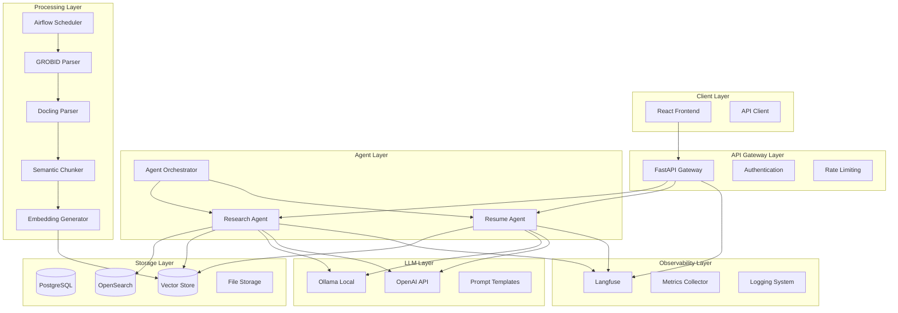

# Multi-Agent RAG System Design Document

## Overview

The Multi-Agent RAG System is a production-grade, locally-hosted system with API integration capabilities that provides two specialized agents: a Research Paper Curator and a Resume Generator. The system implements a microservices architecture with clear separation of concerns, enabling scalable and maintainable operations.

The architecture follows a layered approach with distinct data ingestion, processing, storage, retrieval, and presentation layers. Each agent operates independently while sharing common infrastructure components like the vector store, observability system, and API layer.

## Architecture

### High-Level Architecture



### Component Architecture

The system is organized into six primary layers:

1. **Client Layer**: React-based frontend with modern UI components
2. **API Gateway Layer**: FastAPI-based routing, authentication, and rate limiting
3. **Agent Layer**: Specialized agents for research and resume processing
4. **Processing Layer**: Data ingestion, parsing, and embedding pipelines
5. **Storage Layer**: Multi-modal storage for metadata, vectors, and files
6. **LLM Layer**: Local and API-based language model integration

## Components and Interfaces

### Research Agent

**Purpose**: Handles research paper ingestion, indexing, and query processing

**Core Components**:
- `PaperIngestionService`: Manages arXiv API integration and PDF downloads
- `ContentExtractor`: Orchestrates GROBID/Docling parsing with fallback logic
- `SemanticChunker`: Implements intelligent content chunking preserving paper structure
- `HybridSearchEngine`: Combines BM25 and vector search for optimal retrieval
- `QueryExpander`: Enhances user queries with domain-specific expansions
- `AnswerGenerator`: Generates comprehensive responses using retrieved context

**Key Interfaces**:
```python
class ResearchAgent:
    async def ingest_papers(self, source: str, date_range: DateRange) -> IngestionResult
    async def search_papers(self, query: str, filters: SearchFilters) -> SearchResult
    async def generate_answer(self, query: str, context: List[Chunk]) -> Answer
    async def get_paper_metadata(self, paper_id: str) -> PaperMetadata
```

### Resume Agent

**Purpose**: Handles resume analysis, enhancement, and job-specific customization

**Core Components**:
- `ResumeParser`: Extracts structured data from various resume formats
- `ContentAnalyzer`: Analyzes resume completeness and quality metrics
- `EnhancementEngine`: Generates improvement suggestions based on best practices
- `JobMatcher`: Analyzes job descriptions and identifies optimization opportunities
- `ATSOptimizer`: Ensures resume compatibility with Applicant Tracking Systems
- `FormatGenerator`: Produces resumes in multiple output formats

**Key Interfaces**:
```python
class ResumeAgent:
    async def parse_resume(self, file: UploadFile) -> ParsedResume
    async def analyze_resume(self, resume: ParsedResume) -> AnalysisResult
    async def enhance_resume(self, resume: ParsedResume) -> EnhancedResume
    async def customize_for_job(self, resume: ParsedResume, job_desc: str) -> CustomizedResume
    async def generate_formats(self, resume: ParsedResume, formats: List[str]) -> Dict[str, bytes]
```

### Data Ingestion Pipeline

**Architecture**: Airflow-based DAG system with error handling and monitoring

**Pipeline Stages**:
1. **Source Monitoring**: Daily arXiv API polling for new papers
2. **Download Management**: Parallel PDF downloads with retry logic
3. **Content Extraction**: GROBID primary parsing with Docling fallback
4. **Quality Validation**: Content quality checks and metadata validation
5. **Chunking Strategy**: Semantic-aware chunking preserving document structure
6. **Embedding Generation**: SentenceTransformers-based vector creation
7. **Index Updates**: Incremental updates to search indices

**DAG Configuration**:
```python
dag_config = {
    'schedule_interval': '@daily',
    'max_active_runs': 1,
    'catchup': False,
    'retries': 3,
    'retry_delay': timedelta(minutes=15)
}
```

### Storage Architecture

**PostgreSQL Schema**:
- `papers`: Core paper metadata (title, authors, abstract, publication_date)
- `authors`: Author information with disambiguation
- `categories`: arXiv category taxonomy
- `chunks`: Text chunks with metadata and relationships
- `embeddings`: Vector embeddings with dimensionality metadata
- `resumes`: User resume metadata and processing history
- `jobs`: Job description analysis results

**OpenSearch Indices**:
- `papers_index`: Full-text search with BM25 scoring
- `chunks_index`: Chunk-level search with hybrid scoring
- `resumes_index`: Resume content search and matching

**Vector Store Design**:
- **Embedding Model**: SentenceTransformers (all-MiniLM-L6-v2)
- **Dimensionality**: 384 dimensions
- **Index Type**: HNSW for efficient similarity search
- **Metadata**: Chunk source, paper ID, section type, confidence scores

### Hybrid Search Implementation

**Search Strategy**:
1. **Query Processing**: Parse and expand user queries
2. **Parallel Retrieval**: Simultaneous BM25 and vector search
3. **Score Fusion**: Reciprocal Rank Fusion (RRF) for result combination
4. **Re-ranking**: Context-aware re-ranking based on user preferences
5. **Result Filtering**: Apply user-specified filters and constraints

**Scoring Formula**:
```
hybrid_score = α * bm25_score + (1-α) * vector_score
where α = 0.3 (tunable parameter)
```

## Data Models

### Core Data Models

```python
@dataclass
class Paper:
    id: str
    title: str
    authors: List[Author]
    abstract: str
    categories: List[str]
    publication_date: datetime
    arxiv_id: str
    pdf_url: str
    metadata: Dict[str, Any]

@dataclass
class Chunk:
    id: str
    paper_id: str
    content: str
    section_type: str
    position: int
    embedding: Optional[List[float]]
    metadata: ChunkMetadata

@dataclass
class Resume:
    id: str
    user_id: str
    original_content: str
    parsed_data: ParsedResumeData
    analysis_results: AnalysisResult
    enhancement_suggestions: List[Enhancement]
    created_at: datetime
    updated_at: datetime

@dataclass
class JobDescription:
    id: str
    title: str
    company: str
    requirements: List[str]
    skills: List[str]
    experience_level: str
    parsed_content: str
    analysis_results: JobAnalysis
```

### API Models

```python
class SearchRequest(BaseModel):
    query: str
    filters: Optional[SearchFilters] = None
    limit: int = Field(default=10, le=100)
    offset: int = Field(default=0, ge=0)

class ResumeUploadRequest(BaseModel):
    file: UploadFile
    enhancement_type: EnhancementType = EnhancementType.COMPREHENSIVE
    target_job: Optional[str] = None

class AnswerResponse(BaseModel):
    answer: str
    sources: List[Source]
    confidence: float
    processing_time: float
    query_expansion: Optional[str]
```

## Error Handling

### Error Categories and Strategies

**Data Ingestion Errors**:
- **Network Failures**: Exponential backoff with jitter
- **Parsing Failures**: Fallback to alternative parsers
- **Storage Failures**: Transaction rollback and retry mechanisms

**Search and Retrieval Errors**:
- **Index Unavailability**: Graceful degradation to available indices
- **Embedding Failures**: Fallback to keyword-only search
- **Timeout Handling**: Progressive timeout with partial results

**LLM Integration Errors**:
- **API Rate Limits**: Request queuing and backoff strategies
- **Model Unavailability**: Automatic fallback between local and API models
- **Generation Failures**: Retry with simplified prompts

**User Input Errors**:
- **File Format Issues**: Clear error messages with format requirements
- **Invalid Queries**: Query suggestion and correction mechanisms
- **Authentication Failures**: Proper HTTP status codes and error descriptions

### Error Response Format

```python
class ErrorResponse(BaseModel):
    error_code: str
    message: str
    details: Optional[Dict[str, Any]]
    timestamp: datetime
    request_id: str
    suggestions: Optional[List[str]]
```

## Testing Strategy

### Testing Pyramid

**Unit Tests (70%)**:
- Individual component functionality
- Data model validation
- Utility function testing
- Mock-based LLM integration testing

**Integration Tests (20%)**:
- Database integration testing
- API endpoint testing
- Agent workflow testing
- Search pipeline validation

**End-to-End Tests (10%)**:
- Complete user journey testing
- Performance benchmarking
- Load testing scenarios
- Cross-agent interaction testing

### Test Data Strategy

**Research Paper Testing**:
- Curated test dataset of 100 papers across domains
- Synthetic papers for edge case testing
- Ground truth Q&A pairs for evaluation

**Resume Testing**:
- Anonymized resume samples across industries
- Synthetic resumes for privacy compliance
- Job description templates for matching tests

### Performance Testing

**Metrics to Track**:
- Query response time (target: <2 seconds)
- Ingestion throughput (target: 1000 papers/hour)
- Search accuracy (target: nDCG@10 > 0.8)
- System availability (target: 99.9% uptime)

**Load Testing Scenarios**:
- Concurrent user simulation (100+ users)
- Bulk ingestion stress testing
- Memory usage under load
- Database connection pooling efficiency

## Observability and Monitoring

### Langfuse Integration

**Tracking Components**:
- **Prompt Templates**: Version control and A/B testing
- **Generation Traces**: Complete request-response cycles
- **User Feedback**: Quality ratings and improvement suggestions
- **Cost Tracking**: Token usage and API costs

**Metrics Dashboard**:
- Query volume and patterns
- Response quality trends
- System performance metrics
- User engagement analytics

### RAGAS Evaluation

**Evaluation Metrics**:
- **Faithfulness**: Answer accuracy relative to source content
- **Answer Relevancy**: Response relevance to user queries
- **Context Precision**: Retrieval accuracy and ranking quality
- **Context Recall**: Coverage of relevant information

**Automated Evaluation Pipeline**:
- Daily evaluation runs on sample queries
- Regression detection for quality degradation
- Performance comparison across model versions
- Automated alerting for quality thresholds

### Logging Strategy

**Structured Logging Format**:
```python
log_entry = {
    "timestamp": "2024-01-01T12:00:00Z",
    "level": "INFO",
    "service": "research_agent",
    "request_id": "req_123",
    "user_id": "user_456",
    "action": "search_papers",
    "duration_ms": 1500,
    "metadata": {...}
}
```

**Log Aggregation**:
- Centralized logging with structured search
- Real-time alerting for error patterns
- Performance trend analysis
- User behavior analytics

This design provides a robust, scalable foundation for the multi-agent RAG system with clear separation of concerns, comprehensive error handling, and production-ready observability.